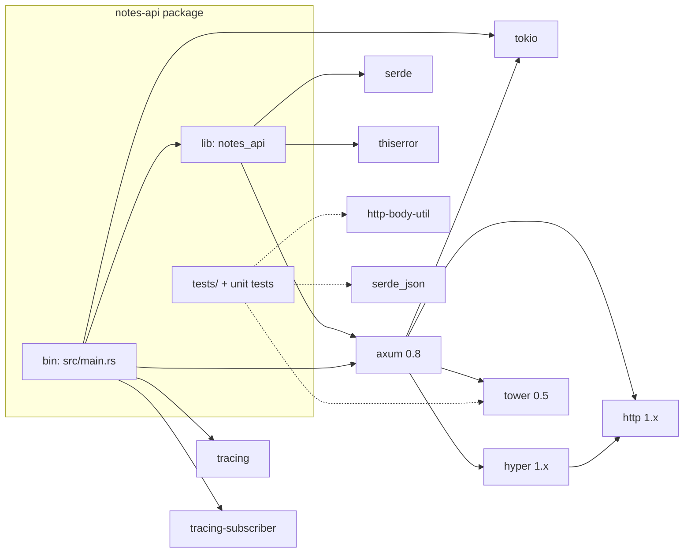
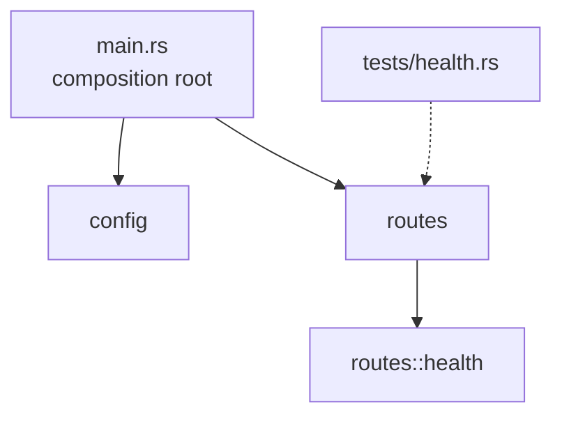
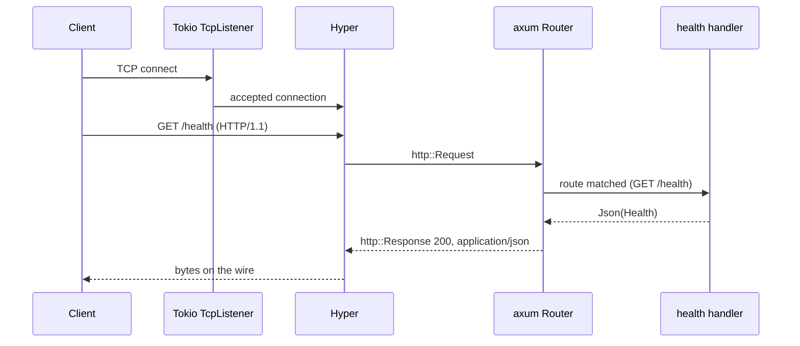

# Architecture

This document explains how `notes-api` is put together and *why*. It describes
the code as of **Milestone 1**; sections marked _planned_ describe the target
for later milestones (see [ROADMAP.md](ROADMAP.md)).

Diagrams use [Mermaid](https://mermaid.js.org), which GitHub and most Markdown
viewers render natively.

## Contents

1. [Goals and non-goals](#goals-and-non-goals)
2. [Layers](#layers)
3. [Crate dependency graph](#crate-dependency-graph)
4. [Module dependency graph](#module-dependency-graph)
5. [Module responsibilities](#module-responsibilities)
6. [Request lifecycle](#request-lifecycle)
7. [Design decisions](#design-decisions)
8. [Planned layout](#planned-layout)

---

## Goals and non-goals

**Goals**

* Idiomatic, modern Rust (edition 2024) and idiomatic axum 0.8.
* Every public item documented; behaviour described by tests.
* A structure that stays understandable as features are added.

**Non-goals (for now)**

* Persistence: notes will live in memory until a database is introduced.
* Authentication, rate limiting and other middleware concerns.
* TLS termination: run behind a reverse proxy in real deployments.

## Layers

The application is a stack in which each layer only knows about the one
directly beneath it.

```text
┌──────────────────────────────────────────────────────────┐
│ main.rs        composition root (config, logging, serve) │
├──────────────────────────────────────────────────────────┤
│ notes_api      routes + config     (our code, testable)  │
├──────────────────────────────────────────────────────────┤
│ axum           Router, extractors, IntoResponse          │
├──────────────────────────────────────────────────────────┤
│ tower / http   Service trait, Request/Response types     │
├──────────────────────────────────────────────────────────┤
│ hyper          HTTP/1.1 (and HTTP/2) protocol            │
├──────────────────────────────────────────────────────────┤
│ tokio          async runtime, TCP sockets, signals       │
└──────────────────────────────────────────────────────────┘
```

This is the "abstraction layers" idea from Chapter 1.9: when something is
confusing, first decide *which layer* it belongs to.

## Crate dependency graph

Solid arrows are normal dependencies. Dotted arrows are dev-dependencies used
only by tests. The edges below `axum` show what axum 0.8 builds on; they are
listed for orientation, not exhaustively.



Why each direct dependency exists:

| Crate | Used by | Purpose |
|-------|---------|---------|
| `axum` | lib, bin | Routing, handlers, `Json`, `axum::serve` |
| `serde` | lib | `#[derive(Serialize)]` for response bodies |
| `thiserror` | lib | `Error` implementations for `ConfigError` |
| `tokio` | bin | Runtime, `TcpListener`, signal handling |
| `tracing`, `tracing-subscriber` | bin | Structured logs, `RUST_LOG` filtering |
| `tower` _(dev)_ | tests | `ServiceExt::oneshot` to call the `Router` directly |
| `http-body-util` _(dev)_ | tests | `BodyExt::collect` to read response bodies |
| `serde_json` _(dev)_ | tests | Parse JSON bodies in assertions |

## Module dependency graph



Rules that keep this graph healthy:

1. **Dependencies point downwards.** `main` may use anything in the library;
   the library never imports from `main`.
2. **Siblings do not import each other.** `config` and `routes` are
   independent. If they ever need to share something, it moves to its own
   module rather than creating a cycle.
3. **Feature modules are self-contained.** A module such as `health` exposes a
   `router()` and keeps its handlers private.

## Module responsibilities

| Module | Public surface | Responsibility | Depends on |
|--------|----------------|----------------|------------|
| `main` | _(binary)_ | Initialise logging, load config, bind the listener, serve, handle shutdown | `config`, `routes`, `tokio`, `tracing*` |
| `config` | `Config`, `ConfigError`, `ADDR_ENV`, `DEFAULT_ADDR` | Read and validate environment settings | `std`, `thiserror` |
| `routes` | `router()` | Merge every feature router into the application `Router` | `axum`, feature modules |
| `routes::health` | `router()`, `Health` | Liveness endpoint | `axum`, `serde` |

## Request lifecycle

What happens for `GET /health` (Chapter 1.8 in practice):



Two edge cases the router resolves without any code of ours:

* **Unknown path** → `404 Not Found`.
* **Known path, unregistered method** → `405 Method Not Allowed`.

Both are covered by `tests/health.rs`.

## Design decisions

### 1. Library plus thin binary

`src/lib.rs` holds everything testable; `src/main.rs` only wires and runs it.
Integration tests can then build the real `Router` without starting a server.

### 2. Router constructors return a finished `Router`

`routes::router()` returns `Router` (that is, `Router<()>`). The `Service`
implementation that `tower::ServiceExt::oneshot` relies on is provided for a
fully assembled router, so when shared state is introduced the constructor will
accept the state and call `.with_state(...)` internally. Tests and `main` keep
the same one-line call.

### 3. Pure configuration parsing

`Config::from_env` delegates to a private function that receives the result of
`std::env::var`. Tests feed it values directly. In edition 2024
`std::env::set_var` is `unsafe`, and mutating the environment in parallel tests
is racy, so we avoid it entirely.

### 4. Fail fast on bad configuration

Configuration errors are typed (`ConfigError`) and surface before the socket is
bound. The process exits with a message that names the variable and the bad
value.

### 5. Graceful shutdown

`axum::serve(...).with_graceful_shutdown(...)` stops accepting new connections
on `Ctrl+C` or `SIGTERM` and waits for in-flight requests, so deployments do not
drop responses mid-flight.

### 6. Lints as documentation enforcement

`Cargo.toml` forbids `unsafe` code and warns on undocumented public items
(`missing_docs`), so the "documented like a public API" rule is enforced by the
compiler rather than by memory.

### 7. Explicit feature flags

`tokio` features are listed individually instead of `full`, so the runtime
capabilities we depend on are visible in `Cargo.toml`. HTTP/2 support in axum is
an opt-in feature (`http2`) that we have not enabled yet; when the outline's
HTTP/2 material is exercised, it is enabled deliberately.

## Planned layout

Files marked _planned_ do not exist yet; they show where future milestones will
land so the structure does not need to be reshuffled later.

```text
src/
├── main.rs
├── lib.rs
├── config.rs
├── error.rs            (planned, M2/M4) ApiError -> HTTP responses
├── state.rs            (planned, M2)    AppState + in-memory NoteStore
├── models/             (planned, M2)    Note, NewNote, NotePatch
│   └── note.rs
└── routes/
    ├── mod.rs
    ├── health.rs
    ├── notes.rs        (planned, M2)    CRUD on /notes and /notes/{id}
    ├── tags.rs         (planned, M3)    /notes/{id}/tags nested routes
    └── attachments.rs  (planned, M3)    wildcard /attachments/{*path}
```
